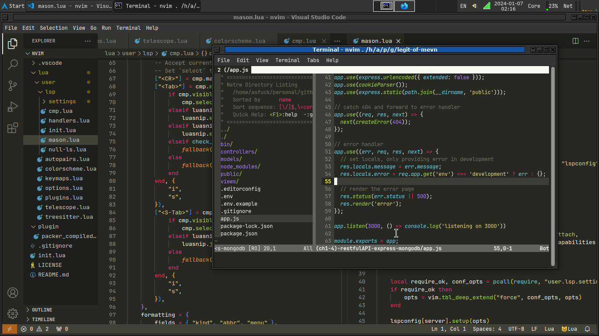

## Neovim Personal Config


### Personal config includes:

|Plugin|Description|
|---|---|
|Colorscheme|Themes that control the colors and styles of the editor UI.|
|Cmp plugins|Autocompletion plugins that provide intelligent suggestions as you type.|
|Snippets|Small templates that quickly insert reusable codes.|
|LSP(Language Server Protocol)|Feature that provides advanced language support like autocompletions, errors checking, and refactoring.|
|Treesitter|Parser that enables rich syntax highlighting and other advanced text parsing features.|
Telescope|Fuzzy finder plugin to quickly search and navigate files, commands, etc.|

See [here](./lua/user/plugins.lua) for the entire plugin.

### Manager plugin.
```lua
-- ./lua/user/plugins.lua

local install_path = fn.stdpath("data") .. "/site/pack/packer/start/packer.nvim"
if fn.empty(fn.glob(install_path)) > 0 then
  PACKER_BOOTSTRAP = fn.system({
    "git",
    "clone",
    "--depth",
    "1",
    "https://github.com/wbthomason/packer.nvim",
    install_path,
  })
  print("Installing packer close and reopen Neovim...")
  vim.cmd([[packadd packer.nvim]])
end
```

### Cmp
> _Where the icons are objects, functions, classes, etc?_

You can change all values with any unicode character you like.
```lua
-- ./lua/user/lsp/cmp.lua

local kind_text_aliases = {
    Text = "txt",
    Method = "mtd",
    Function = "fcn",
    Constructor = "cns",
    Field = "fld",
    Variable = "var",
    Class = "cls",
    Interface = "intf",
    Module = "mdl",
    Property = "prop",
    Unit = "unt",
    Value = "val",
    Enum = "enum",
    Keyword = "key",
    Snippet = "snip",
    Color = "col",
    File = "fl",
    Reference = "ref",
    Folder = "fol",
    EnumMember = "memb",
    Constant = "const",
    Struct = "str",
    Event = "evt",
    Operator = "op",
    TypeParameter = "par"
}
-- find more here: https://www.nerdfonts.com/cheat-sheet
```
## Reference(s)

[Neovim-from-scratch](https://github.com/LunarVim/Neovim-from-scratch)

## LICENSE

[MIT](./LICENSE)
